# Book-App

# 📚 Welcome to the Book App Repository!

**Book App** is a Flutter-based mobile application that allows users to **read books in PDF format** and **listen to audiobooks** with a smooth and intuitive user experience. The app is built with scalability, clean architecture, and usability in mind.

---

## 📱 App Overview

Book App helps users explore books by category, search for specific titles or authors, and enjoy content in both **reading** and **listening** formats.

The application uses a **Bottom Navigation Bar** for seamless navigation between core sections and provides secure authentication for users.

---

## 🧭 Screens Structure

### 🔹 Splash Screen

* Displayed when the app launches
* Redirects users based on authentication status

### 🔹 Authentication Screens

* **Sign In Screen** – for existing users
* **Sign Up Screen** – for new users

---

## 🏠 Main Screen (Bottom Navigation Bar)

The main screen consists of **four primary pages**:

### 📌 Home Page

* Displays books organized by **categories**
* Each category contains a list of related books
* Tapping a book opens the **Book Detail Screen**

### 🔍 Search Page

* Search books by **title or author**
* Includes **Search History**:

    * Stores the **last 5 search queries**
    * Saved locally using `SharedPreferences`

### 📚 Library Page

* Shows books accessed or saved by the user
* Quick access to previously read or listened content

### 👤 Profile Page

* Displays user profile information
* Account-related settings and options

---

## 📖 Book Detail Screen

Opened when a user selects a book. Displays:

* 📕 Book cover image
* 📝 Book title
* ✍️ Author name

### 🔘 Available Actions

* **Read PDF Version**

    * Opens the book in PDF format
    * Implemented using `syncfusion_flutter_pdfviewer`
* **Listen Audio Version**

    * Opens the audiobook player
    * Audio is divided into **chapters**
    * Selecting a chapter starts playback immediately

---

## 🎧 Audio Player Features

* Chapter-based audio playback
* Plays only the selected chapter
* Built using the `audioplayers` package

---

## 🚀 Features

* 📚 Category-based book browsing
* 🔍 Advanced search with persistent search history
* 📖 PDF reading support
* 🎧 Audiobook playback with chapter selection
* 🔐 User authentication (Sign In / Sign Up)
* 🧭 Bottom Navigation Bar navigation
* ⚡ Smooth UI with efficient state management
* ☁️ Backend integration using Supabase

---

## ⚙️ Technologies Used

* **flutter_bloc (^9.1.1)** – State management
* **bloc (^9.1.0)** – Core BLoC implementation
* **supabase_flutter (^2.10.3)** – Authentication and backend services
* **syncfusion_flutter_pdf (^31.2.18)** – PDF processing
* **syncfusion_flutter_pdfviewer (^31.2.18)** – PDF reader UI
* **audioplayers (^6.5.1)** – Audio playback
* **shared_preferences (^2.5.3)** – Local data storage (search history)
* **loading_animation_widget (^1.3.0)** – Loading animations
* **meta (^1.17.0)** – Code annotations and best practices

---

## 🏗 Architecture

* Clean Architecture principles
* BLoC pattern for predictable and scalable state management
* Clear separation between UI, business logic, and data layers

---

## 📌 Conclusion

**Book App** is a modern Flutter application that combines **reading and listening experiences** in one place. It is designed for real-world use, scalable development, and a polished user experience.

---

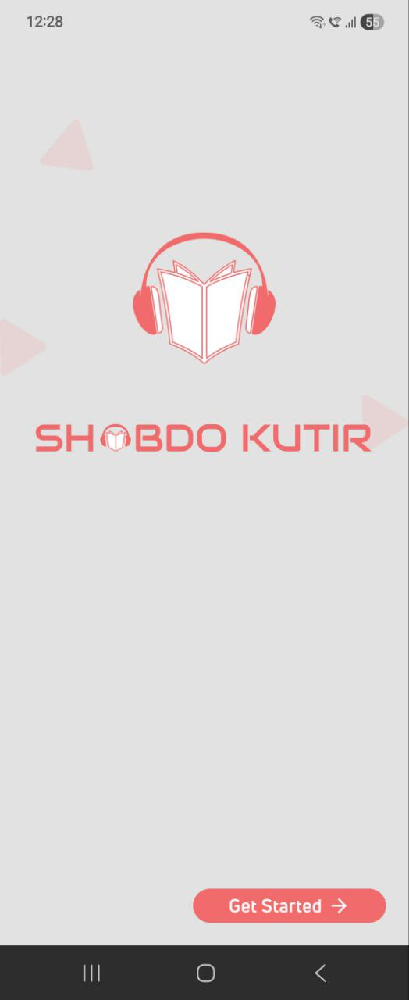
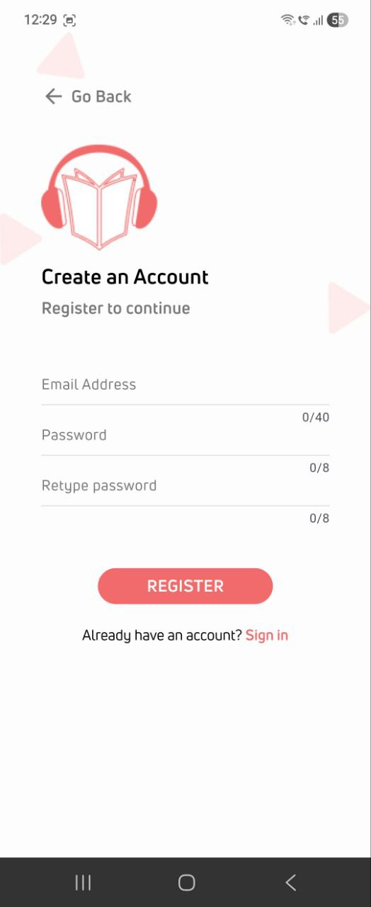
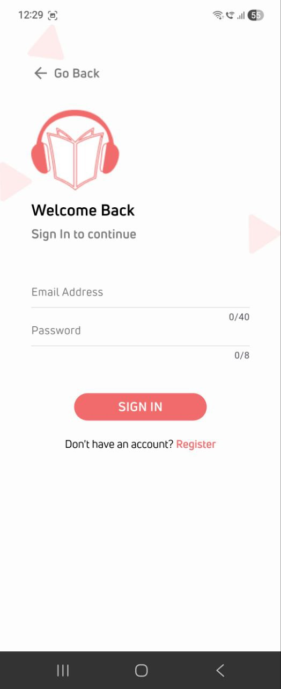
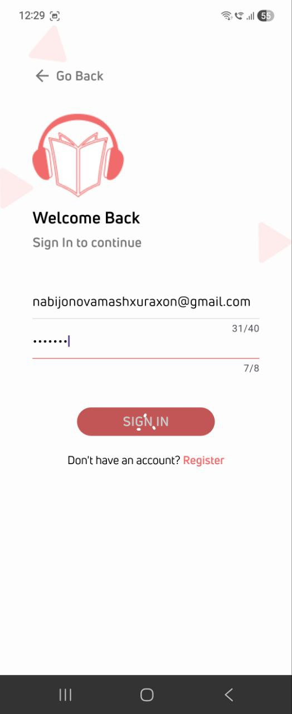
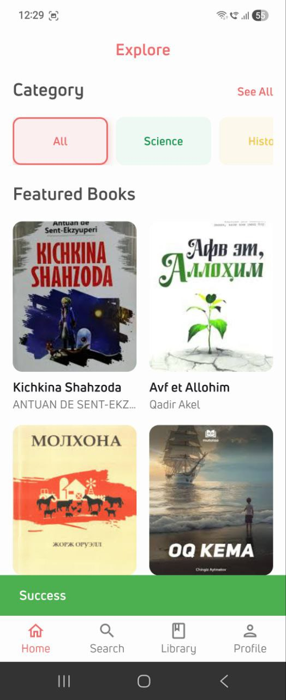
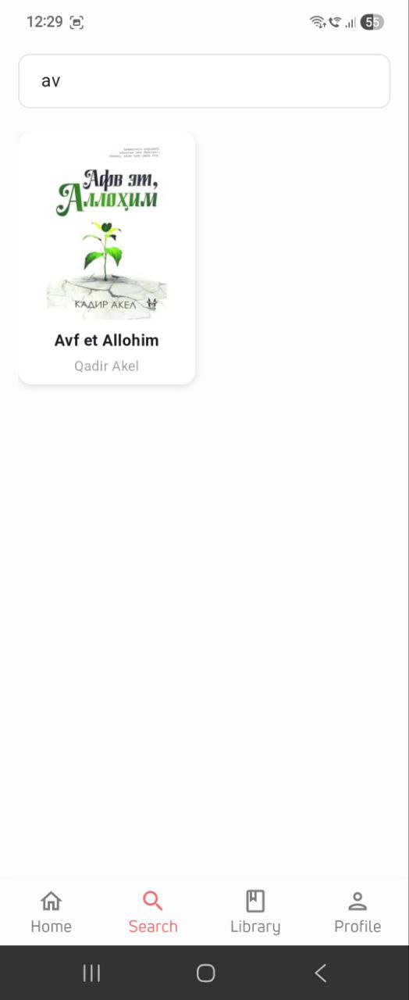
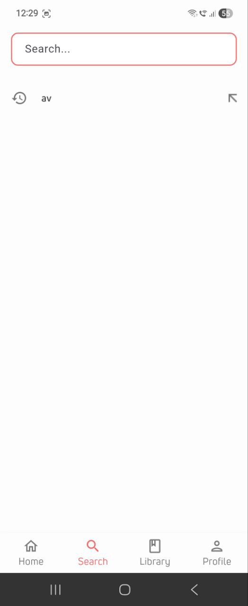
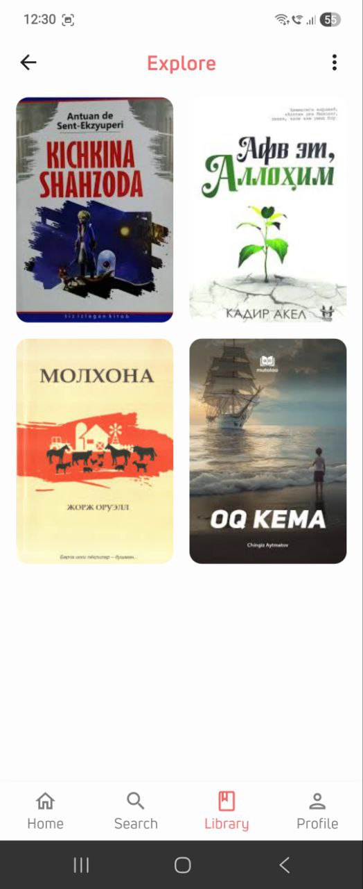
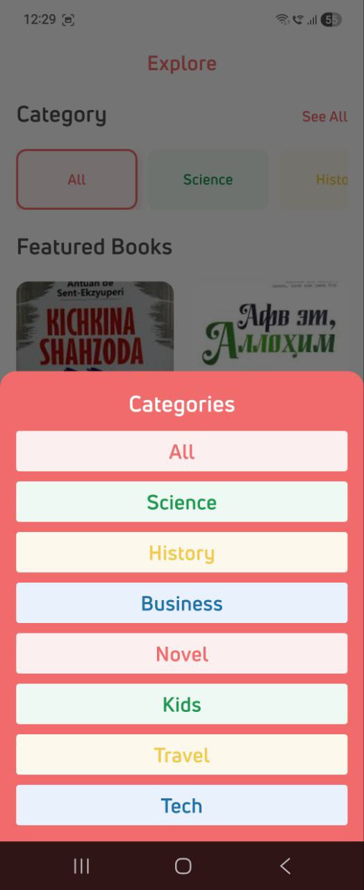
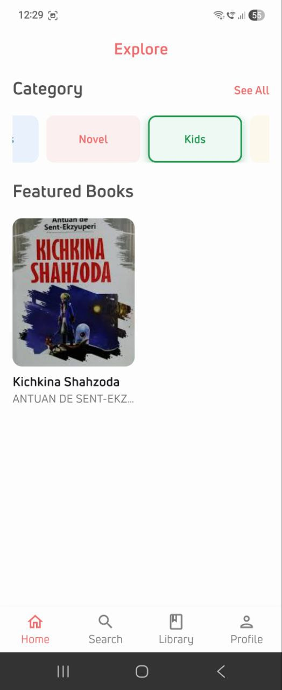
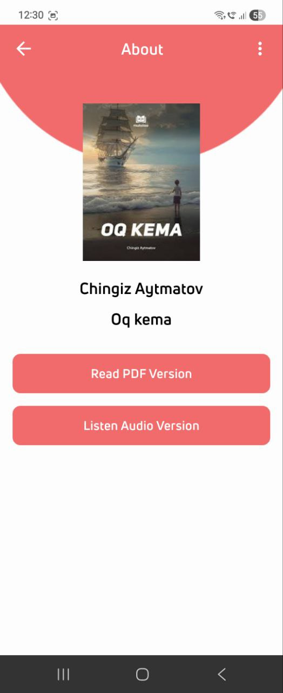
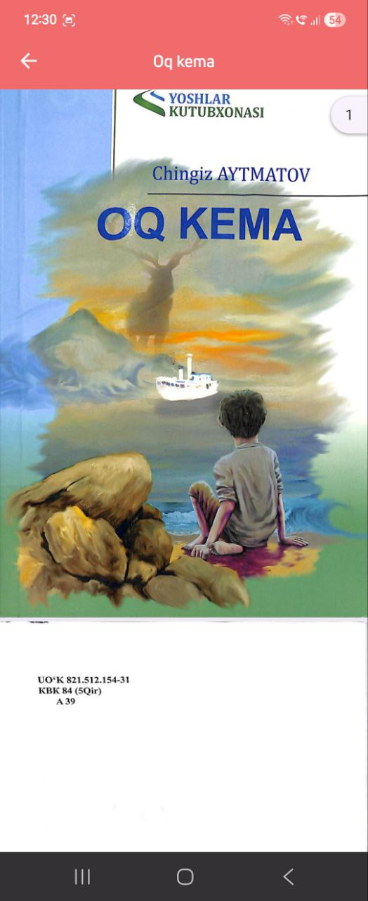
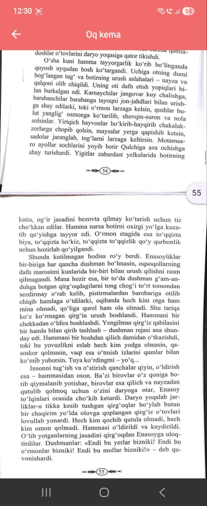
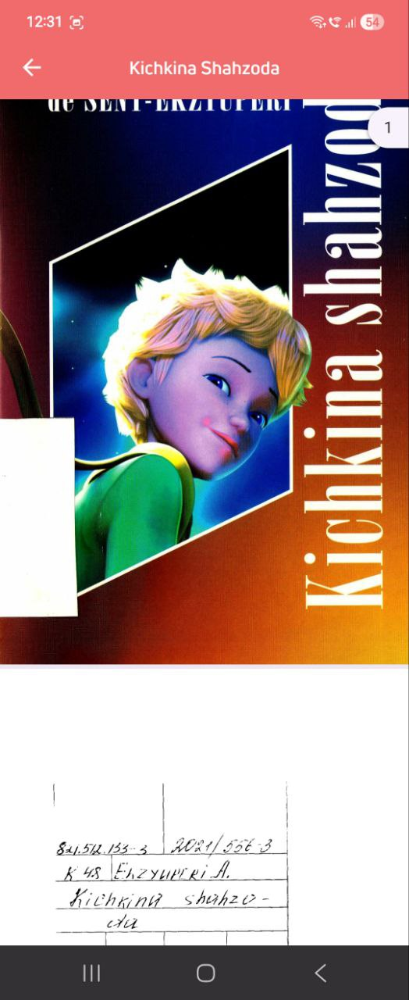
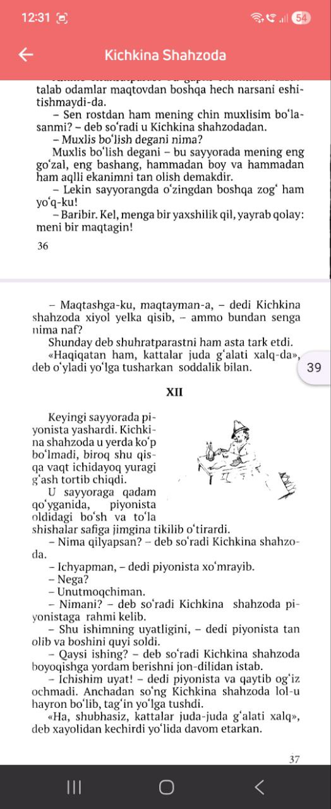
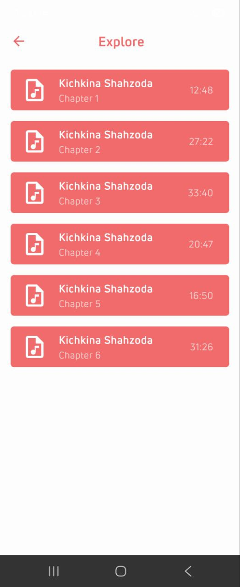
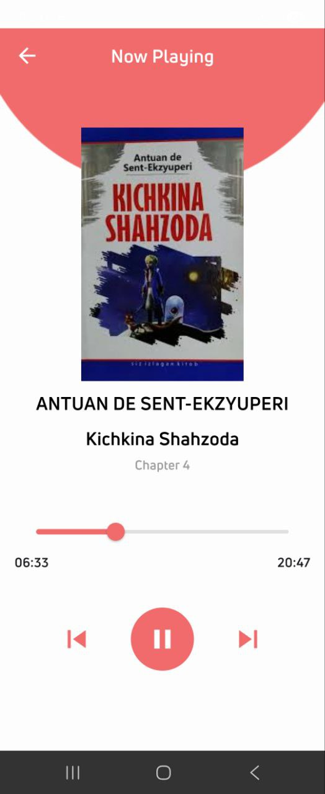
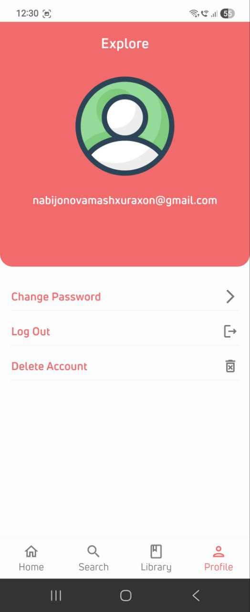